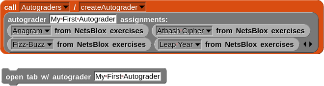
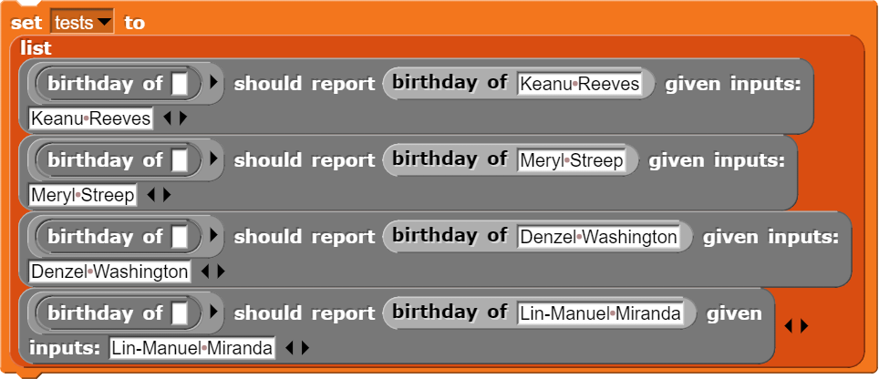

# Programming Exercises in NetsBlox
This repository contains a collection of programming exercises in NetsBlox. Each exercise contains a starter template ("template.xml") and *most* contain test cases. These exercises have been designed to be compatible with the [autograding](https://editor.netsblox.org/docs/services/Autograders/index.html) capabilities in NetsBlox and should be pretty easily composed into your own lessons!

## Getting Started
### Standalone (not using the autograding capabilities)
Feel free to browse the [exercises](./exercises) and open the starter template (ie, the "template.xml" file) of exercises that pique your interest!
- [Acronym](https://editor.netsblox.org#open:https://raw.githubusercontent.com/NetsBlox/exercises/master/exercises/acronym/template.xml). Available as a [Parsons problem](https://editor.netsblox.org#open:https://raw.githubusercontent.com/NetsBlox/exercises/master/exercises/acronym/parsons.xml), too!
- [Actor's Birthday](https://editor.netsblox.org#open:https://raw.githubusercontent.com/NetsBlox/exercises/master/exercises/actor-birthday/template.xml). Available as a [Parsons problem](https://editor.netsblox.org#open:https://raw.githubusercontent.com/NetsBlox/exercises/master/exercises/actor-birthday/parsons.xml), too!
- [Anagram](https://editor.netsblox.org#open:https://raw.githubusercontent.com/NetsBlox/exercises/master/exercises/anagram/template.xml).
- [Atbash Cipher](https://editor.netsblox.org#open:https://raw.githubusercontent.com/NetsBlox/exercises/master/exercises/atbash/template.xml). Available as a [Parsons problem](https://editor.netsblox.org#open:https://raw.githubusercontent.com/NetsBlox/exercises/master/exercises/atbash/parsons.xml), too!
- [Compute the Average](https://editor.netsblox.org#open:https://raw.githubusercontent.com/NetsBlox/exercises/master/exercises/average/template.xml). Available as a [Parsons problem](https://editor.netsblox.org#open:https://raw.githubusercontent.com/NetsBlox/exercises/master/exercises/average/parsons.xml), too!
- [Compute the Average of a List](https://editor.netsblox.org#open:https://raw.githubusercontent.com/NetsBlox/exercises/master/exercises/average-list/template.xml). Available as a [Parsons problem](https://editor.netsblox.org#open:https://raw.githubusercontent.com/NetsBlox/exercises/master/exercises/average-list/parsons.xml), too!
- [Between](https://editor.netsblox.org#open:https://raw.githubusercontent.com/NetsBlox/exercises/master/exercises/between/template.xml). Available as a [Parsons problem](https://editor.netsblox.org#open:https://raw.githubusercontent.com/NetsBlox/exercises/master/exercises/between/parsons.xml), too!
- [Bigram Autocomplete](https://editor.netsblox.org#open:https://raw.githubusercontent.com/NetsBlox/exercises/master/exercises/bigram-autocomplete/template.xml). Available as a [Parsons problem](https://editor.netsblox.org#open:https://raw.githubusercontent.com/NetsBlox/exercises/master/exercises/bigram-autocomplete/parsons.xml), too!
- [Caesar Shift](https://editor.netsblox.org#open:https://raw.githubusercontent.com/NetsBlox/exercises/master/exercises/caesar-shift/template.xml). Available as a [Parsons problem](https://editor.netsblox.org#open:https://raw.githubusercontent.com/NetsBlox/exercises/master/exercises/caesar-shift/parsons.xml), too!
- [Cracking the Caesar Shift with Brute Force](https://editor.netsblox.org#open:https://raw.githubusercontent.com/NetsBlox/exercises/master/exercises/crack-caesar-brute-force/template.xml). Available as a [Parsons problem](https://editor.netsblox.org#open:https://raw.githubusercontent.com/NetsBlox/exercises/master/exercises/crack-caesar-brute-force/parsons.xml), too!
- [Cracking the Caesar Shift with a Partial Solution](https://editor.netsblox.org#open:https://raw.githubusercontent.com/NetsBlox/exercises/master/exercises/crack-caesar-partial-soln/template.xml). Available as a [Parsons problem](https://editor.netsblox.org#open:https://raw.githubusercontent.com/NetsBlox/exercises/master/exercises/crack-caesar-partial-soln/parsons.xml), too!
- [Cyclic Iterator](https://editor.netsblox.org#open:https://raw.githubusercontent.com/NetsBlox/exercises/master/exercises/cyclic-iterator/template.xml). Available as a [Parsons problem](https://editor.netsblox.org#open:https://raw.githubusercontent.com/NetsBlox/exercises/master/exercises/cyclic-iterator/parsons.xml), too!
- [Factorial](https://editor.netsblox.org#open:https://raw.githubusercontent.com/NetsBlox/exercises/master/exercises/factorial/template.xml). Available as a [Parsons problem](https://editor.netsblox.org#open:https://raw.githubusercontent.com/NetsBlox/exercises/master/exercises/factorial/parsons.xml), too!
- [FizzBuzz](https://editor.netsblox.org#open:https://raw.githubusercontent.com/NetsBlox/exercises/master/exercises/fizz-buzz/template.xml).
- [Greet](https://editor.netsblox.org#open:https://raw.githubusercontent.com/NetsBlox/exercises/master/exercises/greet/template.xml). Available as a [Parsons problem](https://editor.netsblox.org#open:https://raw.githubusercontent.com/NetsBlox/exercises/master/exercises/greet/parsons.xml), too!
- [Intro to Infinite Sequences](https://editor.netsblox.org#open:https://raw.githubusercontent.com/NetsBlox/exercises/master/exercises/intro-infinite-sequences/template.xml). Available as a [Parsons problem](https://editor.netsblox.org#open:https://raw.githubusercontent.com/NetsBlox/exercises/master/exercises/intro-infinite-sequences/parsons.xml), too!
- [Isogram](https://editor.netsblox.org#open:https://raw.githubusercontent.com/NetsBlox/exercises/master/exercises/isogram/template.xml).
- [Leap Year](https://editor.netsblox.org#open:https://raw.githubusercontent.com/NetsBlox/exercises/master/exercises/leap-year/template.xml).
- [Counting Letter Frequency](https://editor.netsblox.org#open:https://raw.githubusercontent.com/NetsBlox/exercises/master/exercises/letter-frequency/template.xml). Available as a [Parsons problem](https://editor.netsblox.org#open:https://raw.githubusercontent.com/NetsBlox/exercises/master/exercises/letter-frequency/parsons.xml), too!
- [Counting Letter Frequency as Dictionary](https://editor.netsblox.org#open:https://raw.githubusercontent.com/NetsBlox/exercises/master/exercises/letter-frequency-dictionary/template.xml). Available as a [Parsons problem](https://editor.netsblox.org#open:https://raw.githubusercontent.com/NetsBlox/exercises/master/exercises/letter-frequency-dictionary/parsons.xml), too!
- [Luhn Formula](https://editor.netsblox.org#open:https://raw.githubusercontent.com/NetsBlox/exercises/master/exercises/luhn-formula/template.xml). Available as a [Parsons problem](https://editor.netsblox.org#open:https://raw.githubusercontent.com/NetsBlox/exercises/master/exercises/luhn-formula/parsons.xml), too!
- [Mapping Over Infinite Sequences](https://editor.netsblox.org#open:https://raw.githubusercontent.com/NetsBlox/exercises/master/exercises/map-sequence/template.xml). Available as a [Parsons problem](https://editor.netsblox.org#open:https://raw.githubusercontent.com/NetsBlox/exercises/master/exercises/map-sequence/parsons.xml), too!
- [Minesweeper](https://editor.netsblox.org#open:https://raw.githubusercontent.com/NetsBlox/exercises/master/exercises/minesweeper/template.xml). Available as a [Parsons problem](https://editor.netsblox.org#open:https://raw.githubusercontent.com/NetsBlox/exercises/master/exercises/minesweeper/parsons.xml), too!
- [Moving Average](https://editor.netsblox.org#open:https://raw.githubusercontent.com/NetsBlox/exercises/master/exercises/moving-average/template.xml). Available as a [Parsons problem](https://editor.netsblox.org#open:https://raw.githubusercontent.com/NetsBlox/exercises/master/exercises/moving-average/parsons.xml), too!
- [Pangram](https://editor.netsblox.org#open:https://raw.githubusercontent.com/NetsBlox/exercises/master/exercises/pangram/template.xml). Available as a [Parsons problem](https://editor.netsblox.org#open:https://raw.githubusercontent.com/NetsBlox/exercises/master/exercises/pangram/parsons.xml), too!
- [Sieve of Eratosthenes](https://editor.netsblox.org#open:https://raw.githubusercontent.com/NetsBlox/exercises/master/exercises/sieve/template.xml). Available as a [Parsons problem](https://editor.netsblox.org#open:https://raw.githubusercontent.com/NetsBlox/exercises/master/exercises/sieve/parsons.xml), too!
- [Sliding Windows](https://editor.netsblox.org#open:https://raw.githubusercontent.com/NetsBlox/exercises/master/exercises/sliding-windows/template.xml).
- [From Infinite Sequences to Finite Lists](https://editor.netsblox.org#open:https://raw.githubusercontent.com/NetsBlox/exercises/master/exercises/take-collect-sequences/template.xml). Available as a [Parsons problem](https://editor.netsblox.org#open:https://raw.githubusercontent.com/NetsBlox/exercises/master/exercises/take-collect-sequences/parsons.xml), too!
- [Transposing Music](https://editor.netsblox.org#open:https://raw.githubusercontent.com/NetsBlox/exercises/master/exercises/transpose-music/template.xml).
- [Vigenere Cipher](https://editor.netsblox.org#open:https://raw.githubusercontent.com/NetsBlox/exercises/master/exercises/vigenere/template.xml). Available as a [Parsons problem](https://editor.netsblox.org#open:https://raw.githubusercontent.com/NetsBlox/exercises/master/exercises/vigenere/parsons.xml), too!


### Build your own lesson!
If you want to compose these exercises into autograded (and automatically loaded!) activities, simply import the "AutograderTools.xml" file into [NetsBlox](https://editor.netsblox.org/) and then use the Autograders service to create your own lesson/set of assignments! An example can be found below:



## Contributing
After cloning the repository, configure the githooks with:
```
git config core.hooksPath .githooks
```
This will ensure that any automated preparation will happen automatically such as updating the autograder tools library.

### Creating the exercise
Next, create the starter template with NetsBlox. Ideally, it includes the following sections:
- The custom block by itself at the top of the scripting area
- A few examples using the block with the expected output
- An advanced example that will work once the custom block is implemented

See the "Moving Average" or "Counting Letter Frequency" exercises for a couple examples.

After implementing the custom block and completing the template, scramble (disconnecting all the blocks) the implementation of the custom block so it is a Parsons problem. Then save it as
```
exercises/<exercise-name>/parsons.xml
```

The empty version of the exercise will be created automatically via one of the githooks.

### Adding the tests
Next, we need to add the automated tests for the exercise. The tests are defined using the (JSON) specification found in the Autograders service. Since multidimensional lists can be easily exported as JSON, we can define the tests in the environment using the custom blocks from the "Autograder helpers" community library. Here is an example for the "Actor's Birthday" exercise:



After setting the variable to these tests, we can right click the watcher and select "export" to download them as JSON. Simply copy this file to `exercises/<exercise-name>/tests.json` and the tests will be added!

### Final touches
Finally, we can add some of the last remaining metadata. Most importantly, we need to add a `name.txt` file with the assignment name. An overview of the files for the exercise can be found below.
- name.txt: The display name for the activity
- parsons.xml: The activity as a Parsons problem. Used to generate the empty version.
- template.xml: The starter template for the project (Generated automatically from the parsons.xml file)
- tests.json: The test cases to use when grading the activity
- credits.txt [optional]: Any attributions to sources of inspiration, etc, for the activity